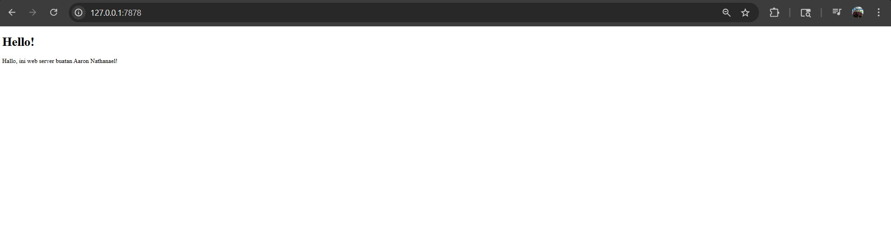
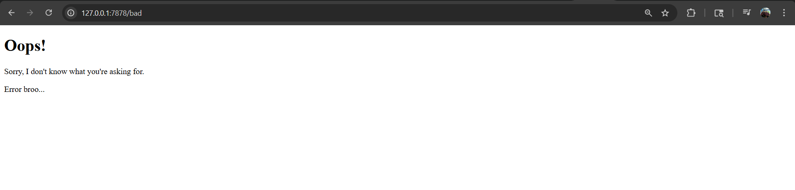

Commit 1 Reflection notes

Pada tahap awal ini, fungsi handle_connection ditambahkan untuk menangani koneksi TCP yang masuk dan mengekstrak informasi HTTP Request dari browser. Berikut adalah penjelasan mengenai cara kerja kode di dalam fungsi tersebut:

TcpStream dan BufReader: Parameter stream merepresentasikan koneksi yang terbuka antara client (browser) dan server. Untuk membaca data dari koneksi ini dengan lebih efisien, koneksi tersebut dibungkus menggunakan BufReader. BufReader mengelola pembacaan data menggunakan metode buffering, dibandingkan harus membaca data byte demi byte secara langsung dari OS.

.lines(): Method ini disediakan oleh trait BufRead untuk membaca stream data dan mengembalikannya sebagai iterator yang memecah data baris demi baris setiap kali menemukan indikator newline.

.map(|result| result.unwrap()): Setiap pemanggilan dari .lines() mengembalikan tipe Result karena pembacaan data dari jaringan memiliki potensi error. Pemanggilan .unwrap() di dalam fungsi closure ini bertugas untuk mengekstrak isi String jika pembacaan berhasil, dan akan menghentikan program jika terjadi error.

.take_while(|line| !line.is_empty()): Berdasarkan standar protokol HTTP, request header dari browser akan diakhiri oleh dua baris baru (CRLF berurutan) yang terbaca sebagai satu baris kosong. Method ini akan memastikan server hanya membaca stream secara terus-menerus selama baris tersebut tidak kosong (hingga akhir dari HTTP header).

.collect(): Berfungsi sebagai consumer yang mengambil semua hasil dari iterator sebelumnya dan mengumpulkannya menjadi sebuah koleksi data baru, yaitu Vec<_> (vektor string), sehingga data request dapat dicetak dan diamati.

Kesimpulannya, kode ini bertugas menangkap rentetan teks yang dikirimkan oleh browser, membacanya secara efisien hingga batas header HTTP selesai, dan menyimpannya ke dalam bentuk vektor (Array/List) agar mudah dikelola oleh program kita selanjutnya.

Commit 2 Reflection notes

Pada tahap ini, server dikembangkan agar tidak hanya membaca request, tetapi juga merespons dengan mengirimkan sebuah file HTML. Berikut adalah hal baru yang dipelajari dari penambahan kode di handle_connection:

fs::read_to_string("hello.html"): Fungsi dari modul file system (std::fs) ini digunakan untuk membaca seluruh isi file hello.html ke dalam bentuk String.

Format Response HTTP: Sebuah respons HTTP yang valid membutuhkan format tertentu. Kode menggunakan makro format! untuk menyusun respons yang terdiri dari:
- status_line (HTTP/1.1 200 OK) untuk memberitahu browser bahwa request berhasil.
- Content-Length: Header wajib untuk memberitahu browser ukuran/panjang data yang dikirimkan.
- Baris kosong (\r\n\r\n) sebagai pemisah antara header dan body.
- contents: Isi dari file HTML itu sendiri.
- stream.write_all(): Digunakan untuk mengubah string response yang sudah disusun menjadi urutan bytes, lalu mengirimkannya kembali ke koneksi TCP (browser). unwrap() digunakan di sini untuk menghentikan program jika terjadi kegagalan saat pengiriman data.

Commit 3 Reflection notes

Pada tahap ini, saya menambahkan logika untuk memvalidasi request yang masuk. Server sekarang memeriksa baris pertama dari HTTP request (request_line). Jika request adalah "GET / HTTP/1.1" (meminta halaman utama), server mengembalikan status 200 OK dan file hello.html. Jika tidak sesuai (misalnya meminta URL /bad), server mengembalikan status 404 NOT FOUND dan merender file 404.html.

Terkait proses refactoring, awalnya blok if-else dibuat dengan menduplikasi baris kode untuk fs::read_to_string, format response, dan stream.write_all di setiap kondisinya. Refactoring dilakukan untuk menghindari pengulangan kode (DRY - Don't Repeat Yourself). Alih-alih menulis ulang seluruh proses pengiriman, blok if-else difokuskan hanya untuk mengembalikan dua buah nilai dalam bentuk tuple: (status_line, filename). Proses pembacaan file dan pengiriman respons kemudian cukup ditulis satu kali saja di bagian akhir fungsi, sehingga kode menjadi lebih bersih, ringkas, dan mudah dipelihara.

Commit 4 Reflection notes

Pada tahap ini, saya menambahkan rute baru yaitu /sleep untuk mensimulasikan sebuah proses yang lambat. Ketika rute ini diakses, thread akan dihentikan sementara (sleep) selama 10 detik sebelum mengembalikan file HTML.

Setelah itu, saya melakukan pengujian dengan membuka 2 tab browser. Tab pertama mengakses 127.0.0.1:7878/sleep, dan tak lama kemudian tab kedua mengakses 127.0.0.1:7878 (rute utama). Hasilnya, tab kedua terpaksa menunggu dan tidak langsung menampilkan halaman, melainkan ikut loading sampai proses sleep di tab pertama selesai.

Hal ini membuktikan bahwa server yang dibuat saat ini masih berjalan secara sinkron pada satu thread (single-threaded). Artinya, server hanya mampu memproses satu koneksi dalam satu waktu. Ketika thread tersebut sedang sibuk menangani request yang berat atau lambat, koneksi lain yang masuk akan diblokir dan masuk ke dalam antrean. Arsitektur seperti ini tentu tidak efisien dan tidak siap untuk tahap produksi karena bisa membuat banyak pengguna menunggu lama (bottleneck).

Commit 5 Reflection notes

Pada tahap ini, arsitektur server diubah dari single-threaded menjadi multithreaded menggunakan ThreadPool.

ThreadPool adalah sekumpulan thread yang sudah dijalankan (spawned) dan berada dalam posisi standby untuk menerima tugas. Alih-alih membuat thread baru setiap kali ada request (yang bisa berbahaya jika ada serangan DoS karena akan menghabiskan memori server), kita membatasi jumlah thread yang aktif, misalnya 4 thread.

Cara kerja ThreadPool di Rust ini melibatkan beberapa konsep:

- mpsc (Multiple Producer, Single Consumer): Digunakan sebagai channel komunikasi. Main thread berperan sebagai producer yang mengirimkan tugas (Job), dan kumpulan worker berperan sebagai consumer yang mengantre untuk mengambil tugas tersebut.

- Arc dan Mutex: Karena channel receiver hanya bisa dimiliki oleh satu consumer, sedangkan kita punya banyak worker, kita harus menggunakan Arc (Atomic Reference Counted) agar receiver bisa di-share (dibagikan) ke banyak worker secara aman, dan Mutex (Mutual Exclusion) agar hanya ada satu worker yang mengambil satu Job dalam satu waktu.

Dengan implementasi ini, ketika rute /sleep diakses, hanya satu worker yang akan tertidur. Tiga worker lainnya di dalam pool masih bebas dan siap menerima koneksi baru secara instan, memecahkan masalah bottleneck yang terjadi pada Milestone 4.

